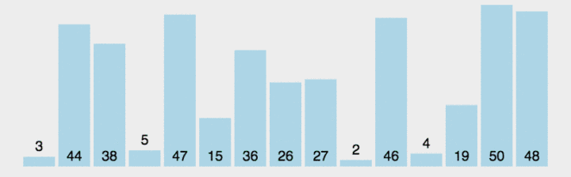
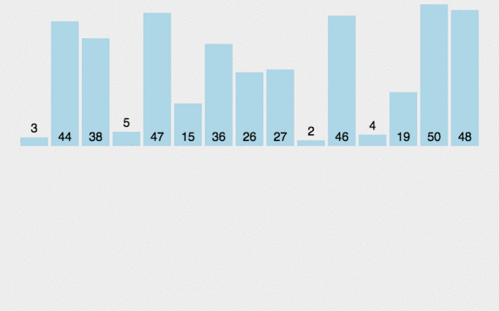

# 排序算法

## 算法的学习方法

* 战略上藐视敌人，战术上重视敌人

* 排序算法的思路简单，细节很多，多画表，多画图，多log

* 如果不想陷入JS的细节，可以使用伪代码，可以更清晰的理解

## 目录

* 选择排序

* 快速排序

* 归并排序

* 计数排序
  
## 选择排序

选择排序思路：

> 1.重复（元素个数-1）次
> 2.把第一个没有排序过的元素设置为最小值
> 3.遍历每个没有排序过的元素
> 4.如果元素 < 现在的最小值，将此元素设置为新的最小值
> 5.将最小值和第一个没有排序过的位置交换

图形展示：


代码:

```javascript

let sort = (numbers) => {

            //numbers.length-1:只剩最后一个数，不需要比较大小
            for(let i=0; i< numbers.length -1; i++){
   
                //+i：原数组最小值被切掉，索引也发生了改变
                let index = minIndex(numbers.slice(i))+ i

                //如果数字与下标不相等，则调换位置
                if(index!==i){
                    swap(numbers,index,i)
                    console.log(`swap ${index}: ${i}`)
                    console.log(numbers)
                }
            }
            return numbers
        }

        //minindex重写获取最小值
        let minIndex = (numbers) => {
            //默认下标为0
          let index = 0
            for(let i=1; i<numbers.length; i++){
                if(numbers[i] < numbers[index]){
                      index = i
              }
          }
          return index
        }
          
        //定义swap,对换位置
        let swap = (array, i, j)=>{
            let temp = array[i]
            array[i] = array[j]
            array[j] = temp
        }

```

## 快速排序

快速排序思路：

> 1.以一个数为基准(中间的数)，比基准小的放到左边，比基准大的放到右边
> 2.再按此方法对这两部分数据分别进行快速排序（递归进行）
> 3.不能再分后退出递归，并重新将数组合并

图形展示：



代码：

```javascript

  let quickSort = arr =>  {

            //if:如果数组的长度小于等于1，则直接返回数组
            if(arr.length <= 1){
                return arr
            }

            //基准索引
            let pivotIndex = Math.floor(arr.length / 2)

            //取值赋值
            let pivot = arr.splice(pivotIndex, 1)[0]

            let left = []

            let right = []
            //遍历数组，大于基数放到基数右边，小于放左边
            for(let i = 0; i < arr.length; i++){
                if(arr[i] < pivot){
                    left.push(arr[i])
                }else{
                    right.push(arr[i])
                }
            }
            //返回排好序的数组
            return quickSort(left).concat([pivot], quickSort(right))
        }

```

## 归并排序

归并排序思路：

> 1.不断将数组分成两份比较大小，每个数组只有一个
> 2.将分出来的部分按照大小重新排序并合并

图形展示：



代码：

```javascript

 let mergeSort = arr =>{
            //把数组的长度传递给k，判断如果小于1，则直接返回
            let k = arr.length
            if(k === 1){
                return arr
            }

            let left = arr.slice(0, Math.floor(k/2))
            let right = arr.slice(Math.floor(k/2))
            return merge(mergeSort(left), mergeSort(right))
        }
        let merge = (a, b) =>{
            //a空返回b，b空返回a
            if(a.length === 0) return b
            if(b.length === 0) return a
            
            return a[0] > b[0] ?
            [b[0]].concat(merge(a, b.slice(1))) :
            [a[0]].concat(merge(a.slice(1), b))
        }

```
## 计数排序

计数排序思路：

> 1.找出待排序的数组中最大或最小的元素
> 2.统计数组中每个值为i的元素出现的次数，存入数组c的第i项
> 3.对所有的计数累加
> 4.将数组c的第i项与最大或最小的元素比较，小则调换位置

图形展示：


代码：

```javascript

let countingSort = arr =>{
          //空的哈希表、最大值、返回结果
          let hashTable = {}, max = 0, result = []

          //遍历数组
          for(let i = 0; i < arr.length; i++){
              //判断i是否在哈希表里面
              if(!(arr[i] in hashTable)){
                  hashTable[arr[i]] = 1
              }else{
                  hashTable[arr[i]] += 1
              }

              //谁比我大我就等于谁
              if(arr[i] > max){
                  max = arr[i]
              }
          }
           //遍历哈希表
           for(let j = 0; j <= max; j++){
                  if(j in hashTable){
                      for(let i = 0; i < hashTable[j]; i++){
                          result.push(j)
                      }
                  }
              }
          return result
      }

```